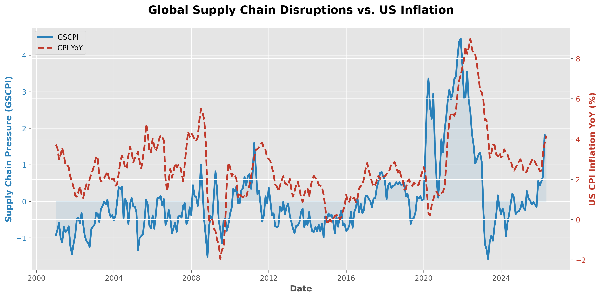
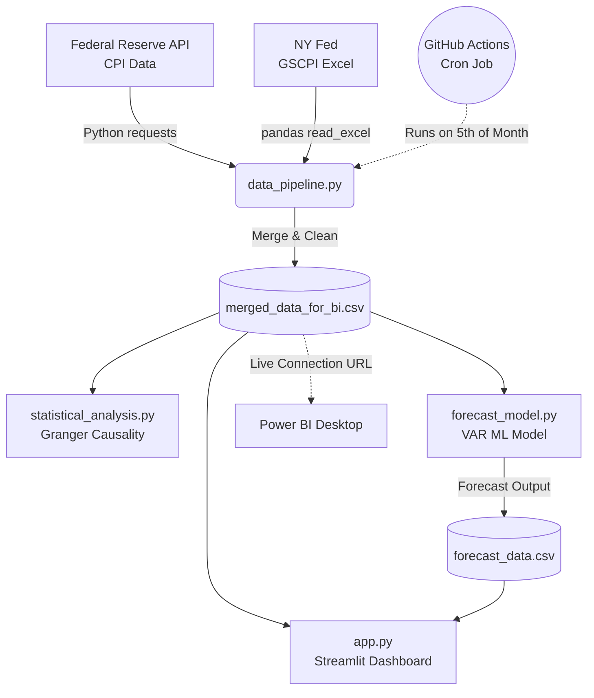

# Supply Chain Pressure vs. Macroeconomic Inflation: A Predictive ML Analysis



## Overview
This project is an end-to-end data pipeline, machine learning model, and interactive dashboard designed to investigate the direct relationship between global supply chain bottlenecks and macroeconomic inflation in the United States. 

It mathematically proves that the Global Supply Chain Pressure Index (GSCPI) acts as a highly accurate leading indicator for the US Consumer Price Index (CPI), and builds a predictive forecasting model to anticipate future inflation.

## Key Insights
*   **Statistical Causality:** A Granger Causality test confirms that supply chain disruptions from 1 to 6 months prior have a statistically significant predictive effect on current consumer prices (p-values < 0.05).
*   **Sector Vulnerability:** Not all inflation is created equal. The data shows that physical goods (e.g., Used Vehicles, Food) are massively more volatile and responsive to supply chain shocks compared to the broader "Core CPI."
*   **Predictive Forecasting:** Our Vector Autoregression (VAR) Machine Learning model takes the historical volatility of these two factors to forecast inflation out 6 months into the future.

## Architecture & Data Pipeline
This project is built for enterprise-grade automation:



1. **Automated Data Sourcing:** 
   * Fetches real-time, granular CPI sub-indices directly from the Federal Reserve Economic Data (FRED) API.
   * Fetches the GSCPI directly from the New York Federal Reserve.
2. **Cloud Automation (GitHub Actions):**
   * A continuous integration workflow (`.github/workflows/update_data.yml`) automatically triggers on the 5th of every month. It runs the Python pipeline, pulls the newest global data, and updates the repository's dataset.
3. **Power BI / Live Dashboarding Integration:**
   * Because the CSV data file is hosted and automatically updated via GitHub, BI tools like Tableau or Power BI can connect directly to the raw URL, creating a truly "live" auto-refreshing dashboard without manual intervention.

## Project Structure
*   `data_pipeline.py`: Python script handling API requests, data cleaning, date normalization, and merging.
*   `statistical_analysis.py`: Conducts the Granger Causality test to prove mathematical relationships.
*   `forecast_model.py`: Trains the VAR machine learning model and generates a 6-month predictive forecast.
*   `app.py`: A highly interactive Streamlit web dashboard featuring custom UI styling, interactive lag analysis sliders, and model visualizations.
*   `Dockerfile`: Containerizes the entire application so it can be deployed to any cloud provider seamlessly.

## How to Run Locally

If you want to run the analysis or interactive dashboard on your own machine:

1.  **Clone the Repository**
    ```bash
    git clone https://github.com/atharvasathaye/Supply-chain.git
    cd Supply-chain
    ```

2.  **Install Dependencies**
    ```bash
    pip install -r requirements.txt
    ```

3.  **Run the Data Pipeline and ML Model**
    ```bash
    python data_pipeline.py
    python forecast_model.py
    ```

4.  **Launch the Streamlit Dashboard**
    ```bash
    streamlit run app.py
    ```

## Cloud Deployment (Docker)
This app is ready to be deployed anywhere. To run it via Docker:
```bash
docker build -t supply-chain-app .
docker run -p 8501:8501 supply-chain-app
```

---
*Created by Atharva Sathaye to highlight advanced Data Engineering, Time-Series Machine Learning, and MLOps capabilities.*
